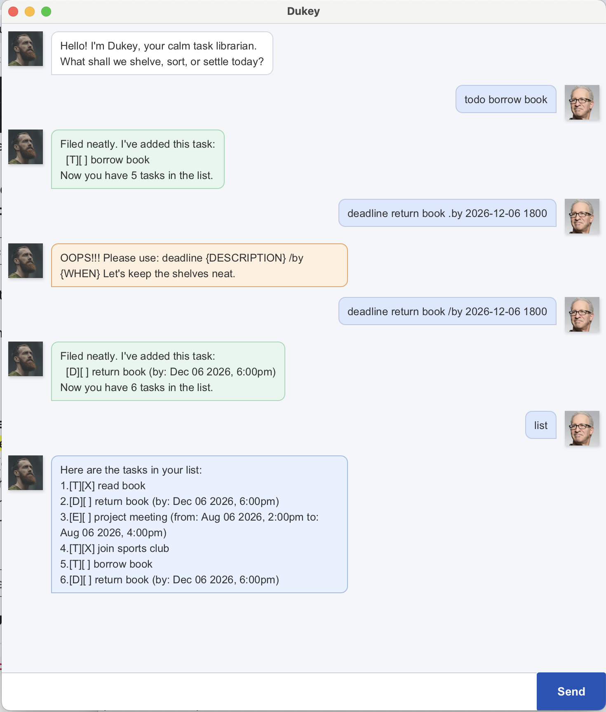

# Dukey User Guide

Dukey is a task chatbot that helps you keep track of todos, deadlines, events,
and task completion statistics. You can use it through the JavaFX GUI or through
the command-line interface.



## Quick Start

1. Make sure Java 25 is available.

   ```bash
   sdk use java 25.0.3.fx-zulu
   ```

2. Run the GUI version.

   ```bash
   ./gradlew run
   ```

3. Type a command into the input box and press Enter.

To run the text-based CLI version instead, use:

```bash
./gradlew runCli
```

## Command Summary

| Action | Format |
| --- | --- |
| Add a todo | `todo DESCRIPTION` |
| Add a deadline | `deadline DESCRIPTION /by yyyy-MM-dd HHmm` |
| Add an event | `event DESCRIPTION /from yyyy-MM-dd HHmm /to yyyy-MM-dd HHmm` |
| List all tasks | `list` |
| Mark a task as done | `mark TASK_NUMBER` |
| Mark a task as not done | `unmark TASK_NUMBER` |
| Delete a task | `delete TASK_NUMBER` |
| Find tasks | `find KEYWORD` |
| Show tasks on a date | `on yyyy-MM-dd` |
| Show statistics | `stats` |
| Exit | `bye` |

Task numbers are one-based. For example, `mark 1` marks the first task in the
list.

## Features

### Adding Todos

Use `todo` for tasks that do not have a date or time.

Example:

```text
todo borrow book
```

Expected response:

```text
Filed neatly. I've added this task:
  [T][ ] borrow book
Now you have 1 tasks in the list.
```

### Adding Deadlines

Use `deadline` for tasks that must be done by a specific date and time.

Format:

```text
deadline DESCRIPTION /by yyyy-MM-dd HHmm
```

Example:

```text
deadline return book /by 2099-12-06 1800
```

Expected response:

```text
Filed neatly. I've added this task:
  [D][ ] return book (by: Dec 06 2099, 6:00pm)
Now you have 2 tasks in the list.
```

The deadline date/time cannot be in the past.

### Adding Events

Use `event` for tasks with a start and end date/time.

Format:

```text
event DESCRIPTION /from yyyy-MM-dd HHmm /to yyyy-MM-dd HHmm
```

Example:

```text
event project meeting /from 2099-08-06 1400 /to 2099-08-06 1600
```

Expected response:

```text
Filed neatly. I've added this task:
  [E][ ] project meeting (from: Aug 06 2099, 2:00pm to: Aug 06 2099, 4:00pm)
Now you have 3 tasks in the list.
```

The start date/time cannot be later than the end date/time.

### Listing Tasks

Use `list` to show all saved tasks.

Example:

```text
list
```

Expected response:

```text
Here are the tasks in your list:
1.[T][ ] borrow book
2.[D][ ] return book (by: Dec 06 2099, 6:00pm)
3.[E][ ] project meeting (from: Aug 06 2099, 2:00pm to: Aug 06 2099, 4:00pm)
```

### Marking And Unmarking Tasks

Use `mark` to mark a task as done.

Example:

```text
mark 1
```

Expected response:

```text
Stamped and settled. I've marked this task as done:
  [T][X] borrow book
```

Use `unmark` to mark a completed task as not done.

Example:

```text
unmark 1
```

Expected response:

```text
Back on the shelf. I've marked this task as not done yet:
  [T][ ] borrow book
```

### Deleting Tasks

Use `delete` to remove a task from the list.

Example:

```text
delete 2
```

Expected response:

```text
Removed from the shelf. I've removed this task:
  [D][ ] return book (by: Dec 06 2099, 6:00pm)
Now you have 2 tasks in the list.
```

### Finding Tasks

Use `find` to search for tasks whose descriptions contain a keyword.

Example:

```text
find book
```

Expected response:

```text
Here are the matching tasks in your list:
1.[T][ ] borrow book
2.[D][ ] return book (by: Dec 06 2099, 6:00pm)
```

### Showing Tasks On A Date

Use `on` to show deadlines and events that occur on a specific date.

Format:

```text
on yyyy-MM-dd
```

Example:

```text
on 2099-08-06
```

Expected response:

```text
Here are the deadlines and events on that date:
3.[E][ ] project meeting (from: Aug 06 2099, 2:00pm to: Aug 06 2099, 4:00pm)
```

Todos are not shown by this command because they do not have dates.

### Viewing Statistics

Use `stats` to view useful task statistics.

Example:

```text
stats
```

Expected response:

```text
Here are your task statistics:
Total tasks: 3
Completed tasks: 1
Pending tasks: 2
Completed in the current calendar week: 1
Completed in the current calendar month: 1
```

The `stats` command does not take arguments. For example, `stats today` is
rejected.

Dukey records the date and time when a task is marked as done. Tasks that were
completed before this feature was introduced may not have a saved completion
timestamp, so they are counted as completed tasks but not as completions in the
current week or month.

### Exiting

Use `bye` to exit Dukey.

Example:

```text
bye
```

Expected response:

```text
Bye. The shelves are tidy for now.
```

## Data Storage

Dukey saves tasks automatically whenever the task list changes. The data file is
stored at:

```text
src/main/data/dukey.txt
```

You do not need to edit this file manually. If the file is missing, Dukey starts
with an empty task list and creates the file again when tasks are saved.

## Troubleshooting

### JavaFX GUI Does Not Start

Use the JavaFX-enabled Java version before running the app:

```bash
sdk use java 25.0.3.fx-zulu
./gradlew run
```

### Date Or Time Is Rejected

Use the exact input format `yyyy-MM-dd HHmm` for deadlines and events.

Valid examples:

```text
deadline return book /by 2099-12-06 1800
event meeting /from 2099-12-06 1400 /to 2099-12-06 1600
```

Invalid examples:

```text
deadline return book /by Sunday
event meeting /from 2pm /to 4pm
```

## Credits

This project started from the CS2103/T iP starter template. The JavaFX GUI
structure follows the SE-EDU JavaFX tutorial used in the course. The bundled
avatar images are adapted from the tutorial resources.
